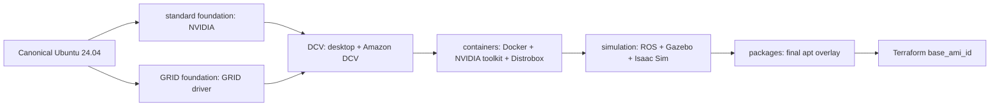

# Architecture

## Overview

The system uses a Terraform-centric two-layer model plus image build:

1. **Core infrastructure layer (Terraform)**
   - VPC, IGW, one public subnet (single AZ), routing
   - Gazebo/Isaac security groups and ingress policies
   - S3 bucket with versioning, encryption, and TLS-only access policy
   - IAM role and instance profile for simulation EC2
   - Launch templates for Gazebo and Isaac
   - SSM parameters for infra config defaults

2. **Runtime layer (Terraform)**
   - Optional single active Spot runtime instance
   - Mode switch by variable (`gazebo` or `isaac`)
   - Optional Isaac runtime EBS volume from snapshot
   - Optional EIP association while runtime is active

3. **Image layer (Packer)**
   - Staged Ubuntu-based AMIs that separate GPU foundation work, DCV/desktop setup, containers, simulation tooling, and package-only overlays

## Image Build Stages

Packer builds AMIs as a chain. The standard and GRID foundation templates start from Canonical Ubuntu and preserve their driver-specific reboot order. A shared DCV stage installs the desktop and Amazon DCV on top of that foundation. Later shared stages select the latest successful parent AMI using generated names plus `RoboticsStage` and `RoboticsVariant` tags. Shared plugin and variable definitions live in `packer/versions.pkr.hcl` and `packer/variables.pkr.hcl`, so stage builds target the `packer/` directory with `-only`.

Each pipeline has one vars file: `packer/robotics-base.pkrvars.hcl` for standard NVIDIA and `packer/robotics-base-grid.pkrvars.hcl` for GRID. Package-tooling changes should be made in the final package stage by editing `packer/scripts/install-packages.sh`, which currently installs Pixi. Login-policy changes stay in the relevant pipeline vars file. The package stage starts from the latest simulation AMI, runs the package tooling script, applies the configured password hash and SSH login policy, runs cleanup, and produces the AMI ID used by Terraform.

## Runtime Control

Runtime lifecycle is driven directly by Terraform variables:

- `runtime_enabled = true` creates a session
- `runtime_enabled = false` removes runtime resources
- `simulation_mode = "gazebo" | "isaac"` selects launch template and mode-specific resources

Terraform outputs provide runtime identifiers and endpoints.

## Network security

- **`trusted_client_cidr`** restricts SSH (22), NICE DCV (8443), and Isaac livestream ports to a client or office CIDR (not `0.0.0.0/0`).
- **Isaac** security group opens fixed livestream ports for that CIDR only: **49100/tcp**, **8210/tcp**, **4799/udp**.
- Isaac streaming is not encrypted at the application layer; treat **public** access as requiring a reverse proxy with **TLS and authentication**, or use private/VPN paths only.

## Storage Model

- **Base AMI/root volume**: OS, tooling, helper scripts
- **Isaac EBS from snapshot**: Isaac-specific mutable runtime state
- **S3**: project artifacts, sync data, and outputs

## Bootstrap Strategy

User data template performs:

- local directory creation
- initial S3 sync-down
- mode-aware startup:
  - Gazebo starts Gazebo helper
  - Isaac attempts volume mount then starts Isaac helper

Bootstrap input parameters (bucket/prefix/workspace path) are resolved via SSM parameter names configured by Terraform.
